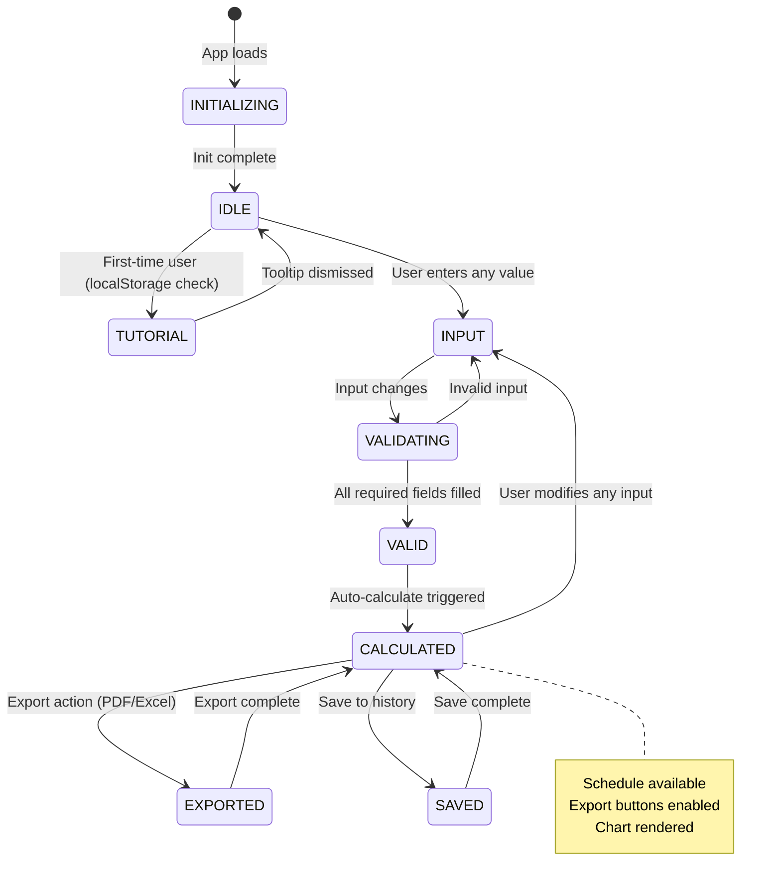
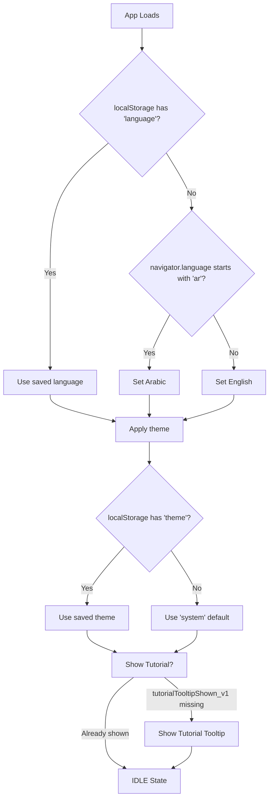
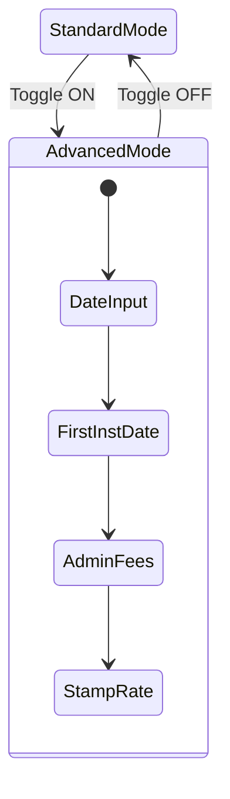
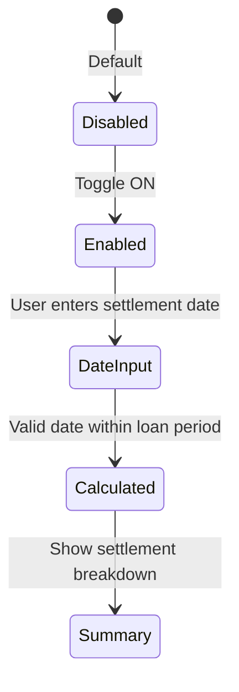
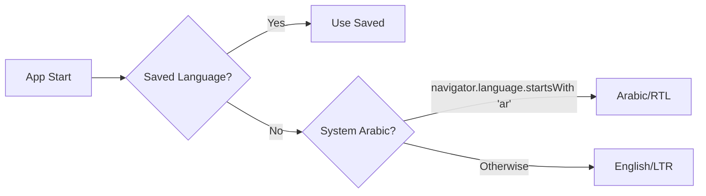
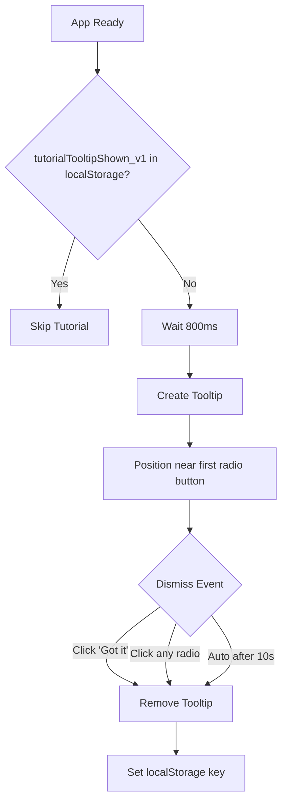

# Loan Calculator - State Model

This document describes the application state flow for the Loan Calculator PWA.

## Application States



## State Descriptions

| State | Description | UI Behavior |
|-------|-------------|-------------|
| **INITIALIZING** | App loading, detecting preferences | Flash prevention, theme/language set from localStorage or system |
| **TUTORIAL** | First-time user sees tooltip | Tutorial tooltip visible, dismisses on click/auto/radio change |
| **IDLE** | Initial state, app ready | All fields empty, placeholder text shown, export disabled |
| **INPUT** | User is entering values | Active field highlighted, validation in progress |
| **VALID** | All required fields have valid values | Ready for calculation |
| **CALCULATED** | Calculation complete, results displayed | Summary visible, chart drawn, schedule available |
| **EXPORTED** | User exported results | PDF/Excel generated, returns to CALCULATED |
| **SAVED** | User saved to history | Toast shown, returns to CALCULATED |

## Initialization Flow



## Field Calculation Model

The app uses an **Active-Field** calculation model with radio button selection:

```
┌─────────────┐    ┌─────────────┐    ┌─────────────┐    ┌─────────────┐
│   Amount    │    │    Rate     │    │   Period    │    │ Installment │
│   (input)   │    │   (input)   │    │   (input)   │    │  (output)   │
└─────────────┘    └─────────────┘    └─────────────┘    └─────────────┘
       │                  │                  │                  │
       └──────────────────┴──────────────────┴──────────────────┘
                                    │
                         ┌──────────┴──────────┐
                         │   Select ONE field  │
                         │    to CALCULATE     │
                         │   (radio button)    │
                         └─────────────────────┘
```

**Rules:**
- User selects which field to calculate via radio button
- Selected field becomes readonly with "Will be calculated" placeholder
- Other fields are editable (inputs)
- Calculation triggers automatically when 3 of 4 fields have valid values

**Radio Button Discoverability:**
- Hint text: "Select which value to calculate" above all fields
- First-time tutorial tooltip (versioned, shows once per version)
- Active target field visually highlighted with indigo border

## Input Validation States

Each input field can be in one of these states:

```
EMPTY → TYPING → VALID / INVALID
                            │
                            ↓
                   Error message shown
```

## Advanced Mode Toggle



**Advanced Mode Reveals:**
- Start Date / Booking Date
- First Installment Date
- Admin Fees (%)
- Stamp Rate (%) with quarterly calculation
- Self-Sufficient Mode (TD Calculator)
- Early Settlement Calculator

## Early Settlement Calculator



**Settlement Calculation:**
- Last paid installment determination
- Principal balance at settlement date
- Accrued interest calculation
- Early settlement fee
- Quarter stamp (if applicable)
- Total settlement amount

## Language Detection Flow



## Tutorial Tooltip Flow



**Versioning:** Increment `TOOLTIP_VERSION` in app.js to show tooltip again to all users.

## Calculation Assumptions

| Assumption | Value | Notes |
|------------|-------|-------|
| Interest Method | Reducing Balance (Annuity) | Standard bank method |
| Day Count | 30/360 | US/NASD method, fixed |
| Rounding | 2 decimal places | Per installment |
| Installment Timing | End of month | Interest accrues from booking |
| Fees Treatment | Deducted upfront | Not amortized into loan |
| Stamp | Quarterly on highest principal | Proportional to period in quarter |

> **Note:** These assumptions are now explicitly displayed to the user in the "Calculation Assumptions" panel for transparency.

## User Trust Features

### "Explain This Number" Tooltips
- Interactive info icons (ℹ) next to complex outputs (Effective Rate, Stamp, First Installment)
- **Behavior:**
  - **Desktop:** Immediate hover feedback directly over icon
  - **Mobile:** Tap interaction
- **State:** Pure CSS-based (`:hover`), no JavaScript state management required
- **Positioning:** Smart anchoring (left/right edge) to prevent overflow clipping

## Offline Behavior

```
ONLINE ────────→ OFFLINE
   │                │
   │   All features │work identically
   │                │
   ↓                ↓
Network      Cache-first
requests     responses
blocked      (SW layer)
```

**Guaranteed Offline:**
- All calculations (local JS)
- All UI interactions
- History persistence (localStorage)
- Theme/Language persistence
- Tutorial tooltip state

## Error Recovery

| Error Type | Recovery Action |
|------------|-----------------|
| Invalid input | Clear error on valid input |
| Calculation fail | Show toast, preserve inputs |
| Export fail | Show toast, retry available |
| Date out of range | Show inline error message |
| No schedule for settlement | Show "Calculate loan first" error |

---

## Implementation Notes

### State Enforcement (Current)

The current implementation enforces states implicitly via:

1. **Field locking** - Radio buttons control `readonly` attribute
2. **`activeKey`** - Tracks which field is being calculated
3. **Validation checks** - Input handlers validate on change
4. **UI enable/disable** - Buttons disabled until `CALCULATED`
5. **localStorage versioning** - Tutorial tooltip uses versioned keys

### localStorage Keys

| Key | Purpose | Example Value |
|-----|---------|---------------|
| `language` | User language preference | `'ar'` or `'en'` |
| `theme` | User theme preference | `'light'`, `'dark'`, `'system'` |
| `tutorialTooltipShown_v1` | Tutorial viewed flag | `'true'` |
| `offlineReadyShown` | Offline toast shown | `'true'` |
| `loanHistory` | Saved calculations | JSON array |

---

*Last updated: Version 1.12.22*
