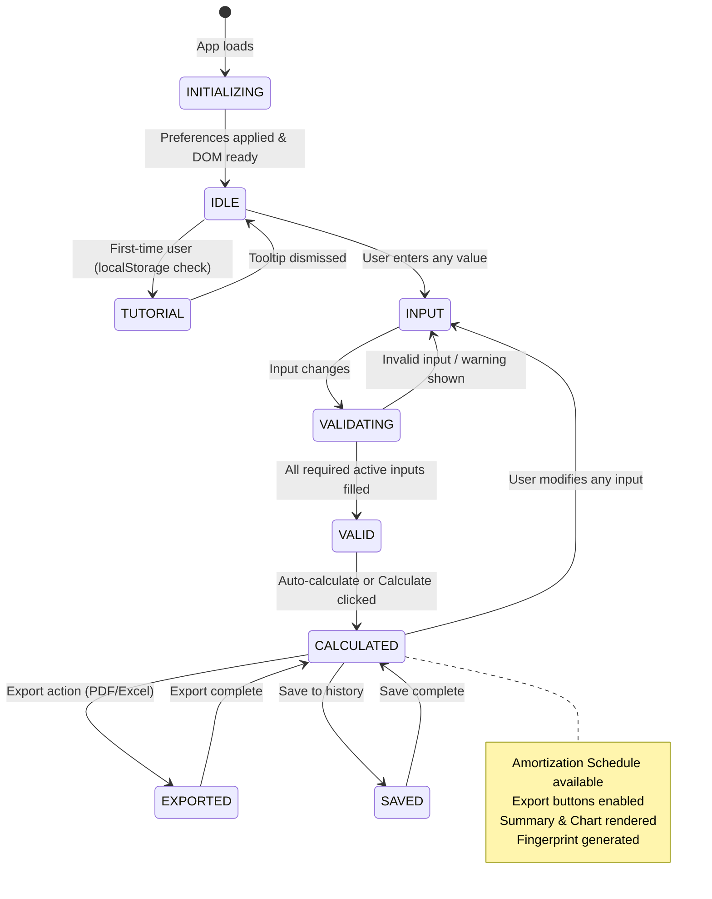
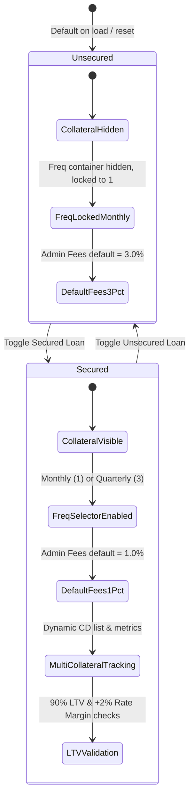
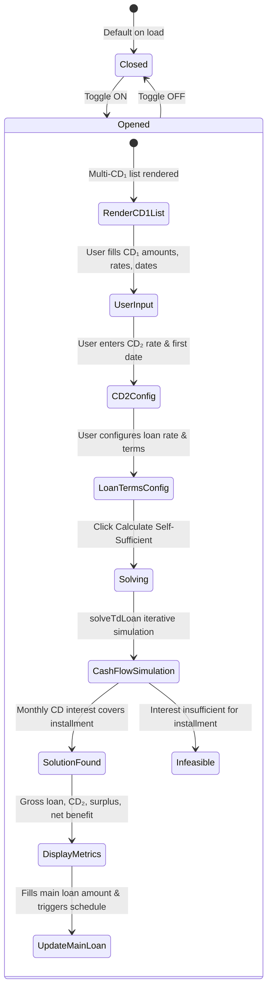
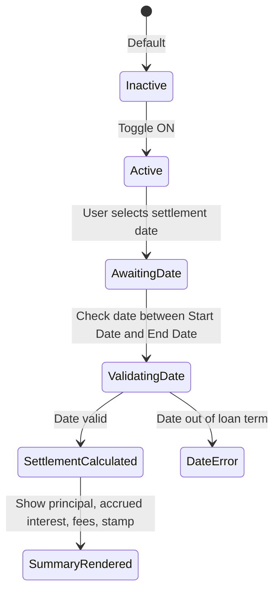

# Loan Calculator - State Model

This document describes the application state flow and data architecture for the Loan Calculator PWA.

**Version:** 2.0.0  
**Last Updated:** 2026-08-29

---

## 1. Application Lifecycle States



---

## 2. State Descriptions

| State | Description | UI Behavior |
|-------|-------------|-------------|
| **INITIALIZING** | App loading, detecting preferences | Theme/language loaded from localStorage or system, flash prevention |
| **TUTORIAL** | First-time user sees guide tooltip | Tutorial tooltip visible pointing to calculation target, dismisses on click/auto |
| **IDLE** | Initial state, app ready | All active fields empty, placeholders shown, export disabled |
| **INPUT** | User is entering or editing values | Target field highlighted, real-time validation & warnings evaluated |
| **VALID** | Required active fields have valid values | Calculation triggers automatically or calculate button is enabled |
| **CALCULATED** | Calculation complete, results displayed | Summary visible, chart drawn, full amortization schedule rendered |
| **EXPORTED** | User exported calculation results | PDF/Excel generated locally, returns to `CALCULATED` |
| **SAVED** | Calculation saved to history | Toast notification shown, record saved to `localStorage` |

---

## 3. Loan Type State Machine (Secured vs. Unsecured)



### Loan Type Behavior:

| Feature / Behavior | Unsecured Loan | Secured Loan |
|--------------------|----------------|--------------|
| **Collateral Section** | Collapsed (`max-h-0`, `opacity-0`) | Expanded (`max-h-[1200px]`, `opacity-100`) |
| **Payment Frequency** | Locked to Monthly (`1`), dropdown hidden | Selectable: Monthly (`1`) or Quarterly (`3`) |
| **Admin Fees Default** | `3.0%` | `1.0%` |
| **Pledged Collaterals** | Not applicable | Dynamic Multi-CD array (`collaterals`) |
| **Max Loan Limit** | Standard credit limits | Dynamic 90% LTV of Total Collateral |
| **Min Rate Rule** | Standard bank rate | Must be $\ge$ Highest Collateral Rate $+ 2.0\%$ |
| **Visual Warnings** | Standard range errors | LTV Exceeded warning & Low Rate warning |

---

## 4. Multi-Collateral System State

```
collaterals = [
    { id: 1, amount: '', rate: '', period: '' },
    { id: 2, amount: '', rate: '', period: '' }
]
```

### Collateral Lifecycle & Animation:
1. **Add Collateral (`#add-collateral-btn`):**
   - New object appended to `collaterals` array with unique `nextCollateralId++`.
   - New row rendered with `.item-enter` slide-in animation.
   - Metrics automatically recalculated.
2. **Remove Collateral (`.col-remove-btn`):**
   - Row styled with `.item-exit` (240ms transition).
   - Filtered from `collaterals` array upon transition end.
   - List re-rendered and summary updated.
3. **Metric Recalculation (`recalcCollateralMetrics()`):**
   $$\text{Total Collateral} = \sum \text{CD Amount}$$
   $$\text{Max Loan (90\%)} = \text{Total Collateral} \times 0.90$$
   $$\text{Min Loan Rate} = \max(\text{CD Rate}) + 2.0\%$$
   $$\text{Weighted Return} = \frac{\sum (\text{CD Amount} \times \text{CD Rate})}{\text{Total Collateral}}$$

---

## 5. Field Calculation Model (Target-Solver Engine)

The calculator uses an **Active-Field Target Selection** model:

```
┌─────────────┐    ┌─────────────┐    ┌─────────────┐    ┌─────────────┐
│   Amount    │    │    Rate     │    │   Period    │    │ Installment │
│   (input)   │    │   (input)   │    │   (input)   │    │  (output)   │
└─────────────┘    └─────────────┘    └─────────────┘    └─────────────┘
       │                  │                  │                  │
       └──────────────────┴──────────────────┴──────────────────┘
                                    │
                         ┌──────────┴──────────┐
                         │   Select ONE field  │
                         │    to CALCULATE     │
                         │   (radio button)    │
                         └─────────────────────┘
```

- **Target Field**: The selected radio button designates the target variable (`AppState.activeKey`).
- **Target Styling**: Target input container becomes readonly, highlighted with an indigo active-target focus ring.
- **Auto-Calculation Trigger**: Fires reliably whenever the other 3 active fields are filled with valid numeric values.

---

## 6. Self-Sufficient Mode State Model (v2.0)



### Self-Sufficient Data Structures:
- **`ssCd1List` Array:**
  ```javascript
  ssCd1List = [
      { id: 1, amount: '100000', rate: '19.0', dateISO: '2026-09-30' },
      { id: 2, amount: '50000',  rate: '20.0', dateISO: '2026-10-15' }
  ];
  ```
- **Modular Cards:**
  1. **Card 1 (Existing CD₁s):** Multi-CD₁ dynamic table with add/delete animations.
  2. **Card 2 (New CD₂):** Certificate rate and first interest date picker.
  3. **Card 3 (Loan Terms):** Booking date, loan rate, loan period, admin fees, and stamp rate.

---

## 7. Early Settlement State Model



---

## 8. Financial Conventions & Calculation Engine

| Parameter | Specification | Banking Rule / Reference |
|-----------|---------------|--------------------------|
| **Interest Method** | Reducing Balance (Annuity) | Egyptian Banking Standard |
| **Day Count Basis** | 30/360 Convention | US/NASD convention |
| **Installment Frequencies** | Monthly ($1$) and Quarterly ($3$) | Periodic interest rate = $\text{Annual Rate} \times \frac{\text{freq}}{12}$ |
| **First Broken Period** | Days from Booking Date to First Due Date | Pro-rated daily interest added to first installment |
| **Stamp Duty Rate** | $0.20\%$ annually ($0.05\%$ quarterly) | Assessed on highest principal balance in calendar quarter |
| **Rounding Policy** | Exact 2 decimal places (piastres) | Per-installment rounding with zero rounding drift |
| **Currency Handling** | Integer piastres internal conversion | Prevents IEEE 754 floating-point arithmetic errors |

---

## 9. Local Storage Schema

| Key | Type | Description | Example |
|-----|------|-------------|---------|
| `language` | String | Active UI language (`'ar'` / `'en'`) | `'ar'` |
| `theme` | String | Active UI theme (`'light'` / `'dark'` / `'system'`) | `'dark'` |
| `tutorialTooltipShown_v1` | String | First-time onboarding flag | `'true'` |
| `loanHistory` | Array<Object> | User-saved calculation records | `[ { id, date, amount, ... } ]` |

---

## 10. Automated Test Suite State

The calculation engine is verified by a 100% offline unit test suite in `js/logic.test.js`:

| Test Suite | Assertions | Focus Areas |
|------------|------------|-------------|
| **Utilities & Rounding** | 21 | `round2`, `toPiastres`, `toCurrency`, `toNum` |
| **Dates & Day Count** | 13 | `days360`, `getQuarterKey`, calendar boundaries |
| **Core Loan Calculations** | 25 | Installments, Loan Amount, Period, Rate, Invalid cases |
| **Amortization Schedules** | 18 | Monthly schedules, advanced dates, quarterly stamp |
| **Early Settlement** | 14 | Settlement balances, penalty fees, accrued interest |
| **Self-Sufficient TD Solver** | 20 | Single & Multi-CD₁ solving, limits, reinvestment |
| **Monthly Backward-Compat** | 12 | Regression verification for existing standard loans |
| **Quarterly Schedules** | 16 | Quarterly steps, broken quarters, 30/360 amortization |
| **Total Automated Assertions** | **139** | **100% Passing (0 Failures)** |
